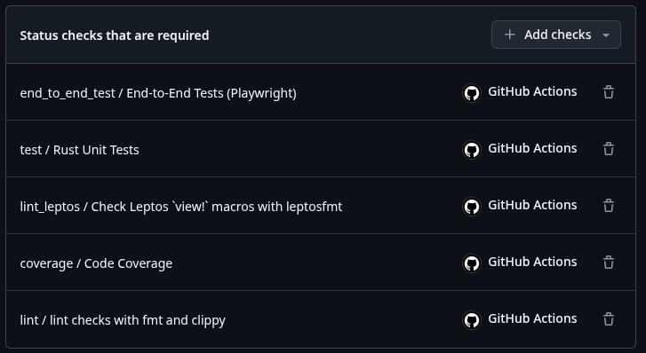
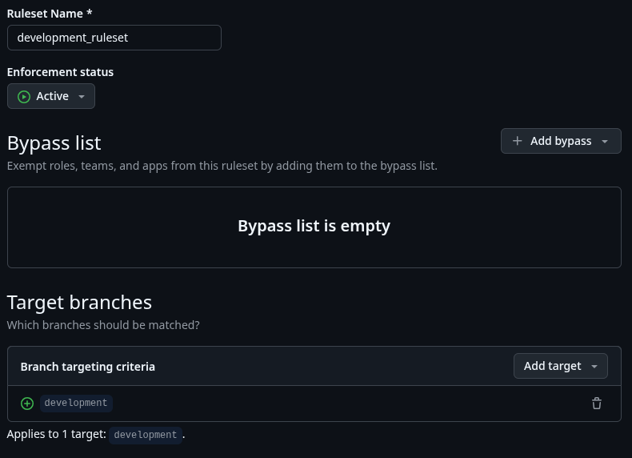
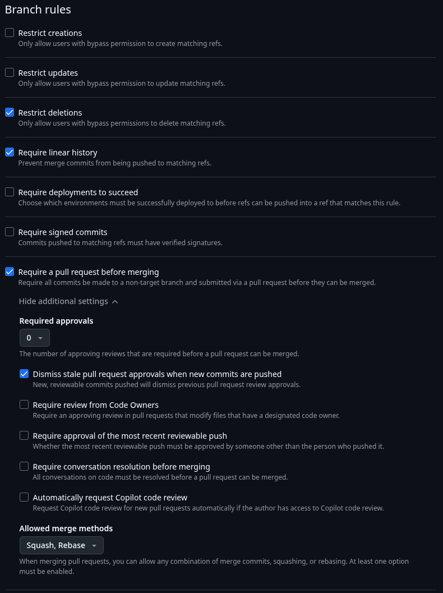
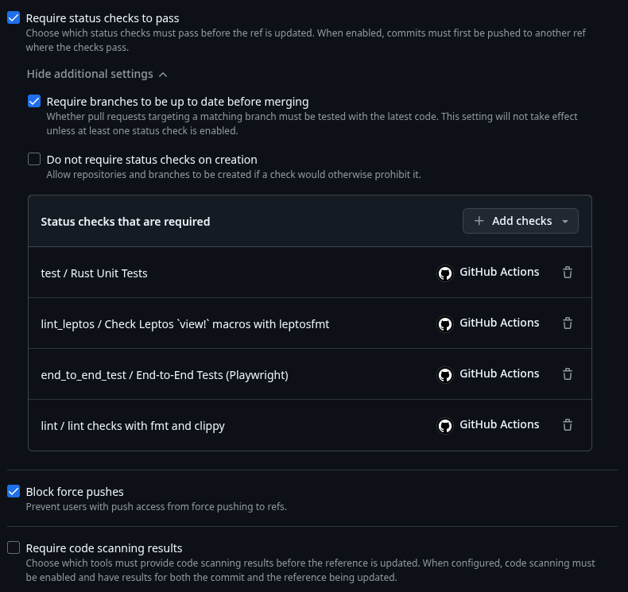

# Projekt Repository auf github einrichten

Dieser Guide geht davon aus, dass du mit dem [Leptos Template](./leptos-template.md) Guide bereits einen lokalen Projektordner aufgesetzt hast. Des Weiteren geht der Guide davon aus, dass du `github desktop` lokal installiert und mit `github` verknüpft hast. Und natürlich, dass du `git` installiert hast...

## Inhaltsverzeichnis

- [Lokales Repository mit github desktop erstellen](#lokales-repository-mit-github-desktop-erstellen)
- [Optional: Lizenz vom Projekt in github anpassen](#optional-lizenz-vom-projekt-in-github-anpassen)
- [Personal access token (PAT) erstellen](#-personal-access-token-pat-erstellen)
- [Secret im Projekt Repository erstellen](#-secret-im-projekt-repository-erstellen)
- [Workflow Berechtigungen für `Sync development with main` und `release-please` anpassen](#workflow-berechtigungen-für--sync-development-with-main-und-release-please-anpassen)
- [Bootstrap release-please](#-bootstrap-release-please)
- [Branch development von main erstellen](#branch-development-von-main-erstellen)
- [Branch Protection für main und development erstellen](#branch-protection-für-main-und-development-erstellen)
- [Projekt in Visual Studio Code öffnen](#projekt-in-visual-studio-code-öffnen)

## Lokales Repository mit github desktop erstellen

`github desktop` öffnen, `File -> Add local repository...` und Projektordner auswählen. Dabei musst du bereits entscheiden, ob das Projekt öffentlich oder privat sein soll. Danach in `github desktop` den initialen commit mit dem folgenden summary erstellen:

```text
chore: initial project setup
```

Wichtig ist hier das `chore:`, um `release-please` von Anfang an mit korrekten commit summaries zu bedienen. Jetzt noch in `github desktop` das Projekt nach github veröffentlichen und github im Browser öffnen.

## Optional: Lizenz vom Projekt in github anpassen

Im geöffneten `github` Projektrepo kannst du eine andere Lizenz für das Projekt wählen, in dem du die `LICENCE` Datei auswählst. Dann den entsprechenden Dialog auswählen, um die neue gewünschte Lizenz auszuwählen. Danach ist es wichtig, die geänderte Datei mit dem richtigen summary zu commiten, um `release-please` konform zu sein:

```text
doc: updated project licence
```

## Allgemeine Einstellungen für Pull Requests

Du findest diese Einstellungen unter

`GitHub Repo > ⚙️ Settings > General`

und dann etwas nach unten scrollen. Setze die Einstellungen wie im Screenshot:

.

## 🔑 Personal access token (PAT) erstellen

Damit `release-please` korrekt funktioniert, wird ein gültiger PAT benötigt. Diesen erstellst du in [`github`](https://github.com/settings/tokens) unter

`Benutzer Profil Icon oben rechts > ⚙️ Settings > Developer Settings > Personal access tokens > Tokens (classic)`

mit den folgenden Einstellungen:


## 🔐 Secret im Projekt Repository erstellen

Damit der PAT in den Workflows genutzt werden kann, muss er als secret `RELEASE_PLEASE_PAT` im Projekt Repository angelegt werden (wenn der Token abgelaufen ist, dann muss `RELEASE_PLEASE_PAT` entsprechend aktualisiert werden.). Das secret erstellst du unter

`GitHub Repo > ⚙️ Settings > Secrets and variables > Actions > New repository secret`

Auf jeden Fall den Namen `RELEASE_PLEASE_PAT` verwenden.

## Workflow Berechtigungen für `🔁 Sync development with main` und `release-please` anpassen

Im [`github workflow`](../workflows/github-workflow.md) wird erläutert, dass nach einem erfolgreichen `pull request` von `development` nach `main` die daraus resultierenden Änderungen in `main` wieder auf `development` zurückgespielt werden müssen. Dies ist aufgrund der Funktionsweise von git und aufgrund von **branch protection rules** (s.u.) etwas komplizieretr, weswegen hierfür der workflow [`sync_development_with_main.yml`](../github/workflows/sync_development_with_main.yml) erstellt wurde. Dieser workflow wie auch der `release-please` workflow nehmen schreibende Aktionen im repository vor und erzeugen einen `pull request`. Die hierfür notwendigen Workflow Permissions sind unter

`GitHub Repo > settings > Actions > General`

wie im Screenshot einzustellen:


## 🚀 Bootstrap release-please

Das vorbereitete Projekt enthält den manuell ausführbaren Workflow [`bootstrap_release_please.yml`](../github/workflows/bootstrap_release_please.yml), mit dem du `release-please` in deinem Projekt vorbereiten kannst. Gehe dazu auf

`GitHub Repo > Actions > GitHub Repo > 🚀 Bootstrap release-please`

und klicke auf **Run workflow**. Dadurch werden die Konfigurationsdateien erstellt, committed und nach 'main' gepusht.

## Branch `development` von `main` erstellen

> 💡 **Hinweis:** stelle sicher, dass du bereits **🚀 Bootstrap release-please**durchgeführt hast.

Erstelle in `github` den branch `development`, abgeleitet von `main`.

## Branch Protection für `main` und `development` erstellen

> 💡 **Hinweis:** Branch Protection Rules sind in `github` nur bei öffentlichen Repos wirksam.

Sowohl `main` als auch `development` sollen nur über `pull request`s bearbeitet werden. Hierfür sind die folgenden Regeln in `github` je Branch unter

`GitHub Repo > ⚙️ Settings > Branches > “Add branch ruleset”`

zu erstellen.

> ⚠️ **Wichtig:** Es muss je branch ein eigenes ruleset erstellt werden, weil bei der Option **Require status checks to pass before merging** (s.u.) branch spezifische Workflows anzugeben sind. Des Weiteren erfordert die Resynchronisierung von `development` nach einem pull request nach `main` einen **Rebase and Merge**, so dass diese Option für `development` erlaubt sein muss, nicht aber für `main`.

> 💡 **Hinweis:** Bei der Regel **Require a pull request before merging** kann über **Required approvals** die Anzahl der notwendigen Zustimmungen für einen `pull request` vorgegeben werden. Wenn man nicht alleine arbeitet, sollte dieser Wert **größer 0** sein.

### Branch ruleset für 'main'

Im oberen Bereich Namen angeben, `Enforcement status` setzen und Branch Namen eingeben (ohne `""`), für die das ruleset gelten soll. Übernehme die angegeben Einstellungen.


Achte bei `Allowed merge methods`, dass nur `Squash` ausgewählt ist. Die Option `Require status checks to pass` kann erst verwendet werden, wenn durch einen commit CI Workflows ausgeführt wurden. Sobald dies erfolgt ist, empfiehlt es sich, diese hier bei `Add checks` hinzuzufügen. Diese sind aber erst nach erstmaligen Durchlauf verfügbar, so dass diese Option erst später gesetzt werden kann.

> ⚠️ **Warnung:** Vergiss nicht, diese checks nachträglich zu setzen, sobald sie einmal durchgelaufen sind.



### Branch ruleset für `development`

Die Regeln für `development` unterscheiden sich nur in zwei Punkten von `main`:

1. Bei **Allowed merge methods** sind **Squash** und **Rebase** erlaubt.
2. Bei den `required checks` entfäält der `Code Coverafe` check.

Denke daran, dass die gelisteten Checks erst **nach** einem erfolgreichen CI Durchlauf verfügbar sind.







## Projekt in Visual Studio Code öffnen

Entweder über `github desktop` oder in der Konsole im Projektordner

```bash
code .
```

ausführen. Dann über die integrierte Quellcodeverwaltung den branch `development` pullen.

---

✅ Setup ist abgeschlossen
