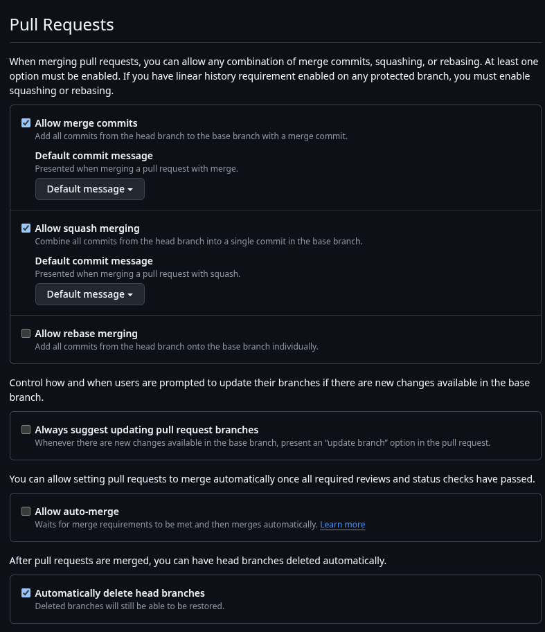
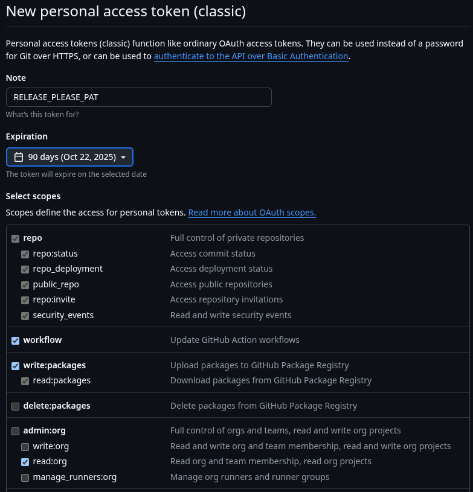
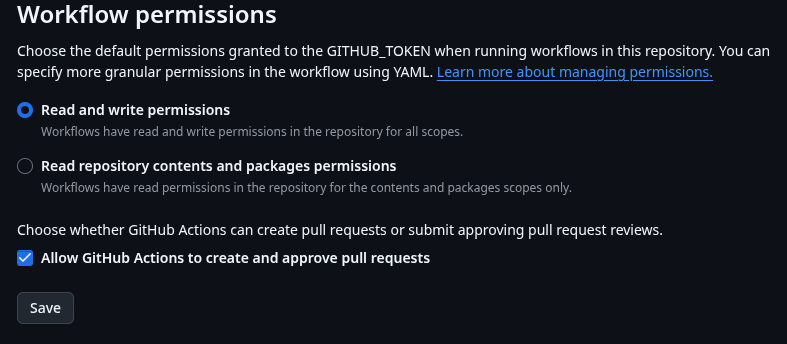
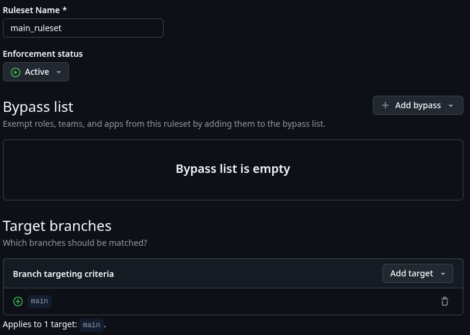
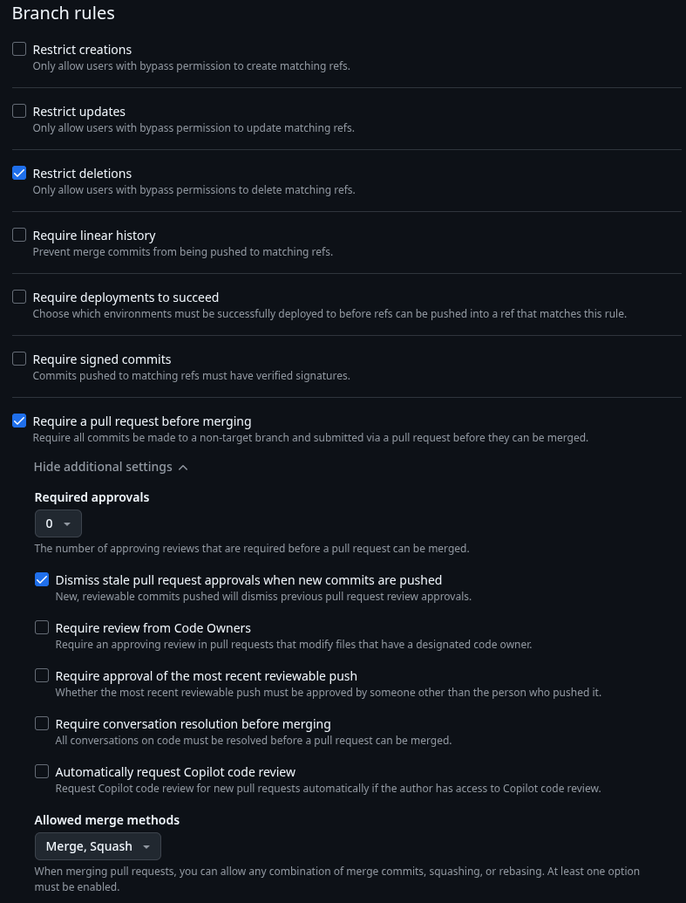
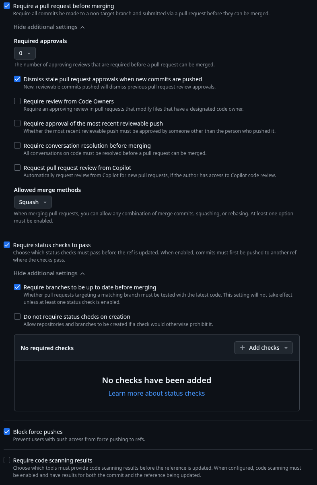

# Projekt Repository auf github einrichten

Dieser Guide geht davon aus, dass du mit dem [Leptos Template](./leptos-template.md) Guide bereits einen lokalen Projektordner aufgesetzt hast. Des Weiteren geht der Guide davon aus, dass du `github desktop` lokal installiert und mit `github` verknüpft hast. Und natürlich, dass du `git` installiert hast...

## Inhaltsverzeichnis

- [Lokales Repository mit github desktop erstellen](#lokales-repository-mit-github-desktop-erstellen)
- [Optional: Lizenz vom Projekt in github anpassen](#optional-lizenz-vom-projekt-in-github-anpassen)
- [Personal access token (PAT) erstellen](#-personal-access-token-pat-erstellen)
- [Secret im Projekt Repository erstellen](#-secret-im-projekt-repository-erstellen)
- [Workflow Berechtigungen für `release-please` anpassen](#workflow-berechtigungen-für-release-please-anpassen)
- [Bootstrap release-please](#-bootstrap-release-please)
- [Branch Protection für main erstellen](#branch-protection-für-main-erstellen)
- [Projekt in Visual Studio Code öffnen](#projekt-in-visual-studio-code-öffnen)

## Lokales Repository mit github desktop erstellen

`github desktop` öffnen, `File -> Add local repository...` und Projektordner auswählen. Dabei musst du bereits entscheiden, ob das Projekt öffentlich oder privat sein soll. Danach in `github desktop` den initialen commit mit dem folgenden summary erstellen:

```text
chore: initial project setup
```

Wichtig ist hier das `chore:`, um `release-please` von Anfang an mit korrekten commit summaries zu bedienen. Jetzt noch in `github desktop` das Projekt nach github veröffentlichen und github im Browser öffnen.

## Optional: Lizenz vom Projekt in github anpassen

Im geöffneten `github` Projektrepo kannst du eine andere Lizenz für das Projekt wählen, in dem du die `LICENCE` Datei auswählst. Dann den entsprechenden Dialog auswählen, um die neue gewünschte Lizenz auszuwählen. Danach ist es wichtig, die geänderte Datei mit dem richtigen summary zu commiten, um `release-please` konform zu sein:

```text
doc: updated project licence
```

## Allgemeine Einstellungen für Pull Requests

Du findest diese Einstellungen unter

`GitHub Repo > ⚙️ Settings > General`

und dann etwas nach unten scrollen. Setze die Einstellungen wie im Screenshot.

> 💡 **Hinweis:** Die Option **Automatically delete head branches** löscht auf Origin automatisch temporäre Feature und Fix Branches, wenn ein Pull Request nach `main` durchgeführt wurde. Der lokale temporäre Branch muss aber weiterhin von Hand gelöscht werden.



## 🔑 Personal access token (PAT) erstellen

Damit `release-please` korrekt funktioniert, wird ein gültiger PAT benötigt. Diesen erstellst du in [`github`](https://github.com/settings/tokens) unter

`Benutzer Profil Icon oben rechts > ⚙️ Settings > Developer Settings > Personal access tokens > Tokens (classic)`

mit den folgenden Einstellungen:



## 🔐 Secret im Projekt Repository erstellen

Damit der PAT in den Workflows genutzt werden kann, muss er als secret `RELEASE_PLEASE_PAT` im Projekt Repository angelegt werden (wenn der Token abgelaufen ist, dann muss `RELEASE_PLEASE_PAT` entsprechend aktualisiert werden.). Das secret erstellst du unter

`GitHub Repo > ⚙️ Settings > Secrets and variables > Actions > New repository secret`

Auf jeden Fall den Namen `RELEASE_PLEASE_PAT` verwenden.

## Workflow Berechtigungen für `release-please` anpassen

Der [`release-please` Workflow](../github/workflows/_release_please.yml) wie auch der [Bootstrap `release-please` Workflow](../github/workflows/bootstrap_release_please.yml) (siehe nächstes Kapitel) nehmen schreibende Aktionen im Repository vor und erzeugen jeweils einen `pull request`. Die hierfür notwendigen Workflow Permissions sind unter

`GitHub Repo > settings > Actions > General`

wie im Screenshot einzustellen:



## 🚀 Bootstrap release-please

Das vorbereitete Projekt enthält den manuell ausführbaren Workflow [`bootstrap_release_please.yml`](../github/workflows/bootstrap_release_please.yml), mit dem du `release-please` in deinem Projekt vorbereiten kannst. Gehe dazu auf

`GitHub Repo > Actions > GitHub Repo > 🚀 Bootstrap release-please`

und klicke auf **Run workflow**. Dadurch werden die Konfigurationsdateien erstellt und ein `pull request` erstellt, der gemergt werden muss.

### Versionslabel in weiteren Dateien mit `release-please` verwalten

`release-please` verwalten das `version` Label in `Cargo.toml`. Wenn dein Projekt weitere versionierte Artefakte enthält (z.B. einer Javascript Service Worker für lokal installierbare Web-Apps), deren Version synchron zur Version in `Cargo.toml` gehalten werden soll, dann kannst du dies über die Konfigurationsdatei `release-please-config.json` von `release-please` konfigurieren.

> 💡 **Hinweis:** `release-please-config.json` wird durch den Bootstrap Vorgang erzeugt. Es bietet sich an, die Anpassung an der Datei in dem Branch vorzunehmen, der durch den Bootsrap Vorgang erstellt wurde.

**Beispiel für `release-please-config.json`**

```json
{
  "packages": {
    ".": {
      "changelog-path": "CHANGELOG.md",
      "release-type": "rust",
      "include-component-in-tag": false,
      "bump-minor-pre-major": false,
      "bump-patch-for-minor-pre-major": false,
      "draft": false,
      "prerelease": false,
      "extra-files": [
        {
          "type": "generic",
          "path": "public/sw.js"
        }
      ]
    }
  },
  "$schema": "https://raw.githubusercontent.com/googleapis/release-please/main/schemas/config.json"
}
```

> ❗ **Wichtig:** Falls nicht vorhanden, füge die Option `"include-component-in-tag": false,` hinzu, damit ein Version Tag ohne dem Namen deines Projektes erzeugt wird.

In dieser Beispielkonfiguration soll die Datei `public/sw.js` ebenfalls versioniert werden. Dazu muss die Zeile, in der sich das Versionslabel befindet, mit dem tag `// x-release-please-version` markiert werden:

```js
const CACHE_NAME = "your_app_name-v0.0.0"; // x-release-please-version
```

Weitere Infos dazu siehe die entsprechende [`release-please`-Doku](https://github.com/googleapis/release-please/blob/d5f2ca8a2cf32701f1d87a85bbc37493b1db65c2/docs/customizing.md).

## Branch Protection für `main` erstellen

> 💡 **Hinweis:** Branch Protection Rules sind in `github` nur bei öffentlichen Repos wirksam.

`main` soll nur über `pull request`s bearbeitet werden. Hierfür sind in `github` unter

`GitHub Repo > ⚙️ Settings > Branches > “Add branch ruleset”`

Regel wie folgt zu erstellen.



Im oberen Bereich Namen angeben, `Enforcement status` setzen und bei Target Branch `main` eingeben (ohne `""`).



Achte bei `Allowed merge methods`, dass nur `Merge` und `Squash` ausgewählt sind.

> 💡 **Hinweis:** Bei der Regel **Require a pull request before merging** kann über **Required approvals** die Anzahl der notwendigen Zustimmungen für einen `pull request` vorgegeben werden. Wenn man nicht alleine arbeitet, sollte dieser Wert **größer 0** sein.



Die Option `Require status checks to pass` kann erst verwendet werden, wenn durch einen commit CI Workflows ausgeführt wurden. Sobald dies erfolgt ist, empfiehlt es sich, diese hier bei `Add checks` hinzuzufügen. Diese sind aber erst nach erstmaligen Durchlauf verfügbar, so dass diese Option erst später gesetzt werden kann.

> ⚠️ **Warnung:** Vergiss nicht, diese checks nachträglich zu setzen, sobald sie einmal durchgelaufen sind.

## Projekt in Visual Studio Code öffnen

Entweder über `github desktop` oder in der Konsole im Projektordner

```bash
code .
```

ausführen. Dann über die integrierte Quellcodeverwaltung den branch `main` pullen.

---

✅ Setup ist abgeschlossen
