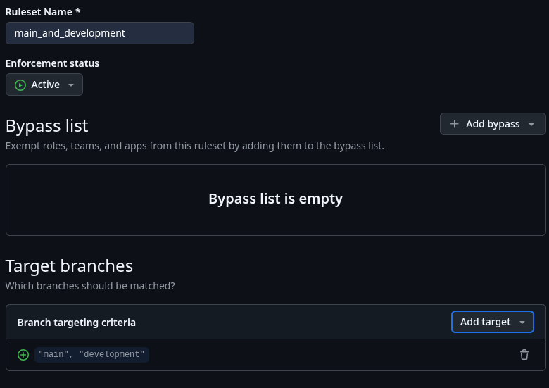
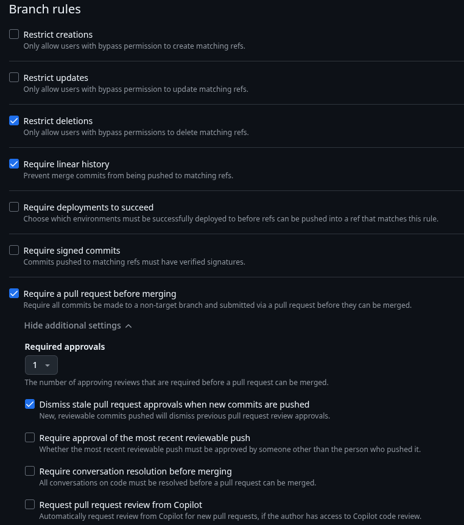
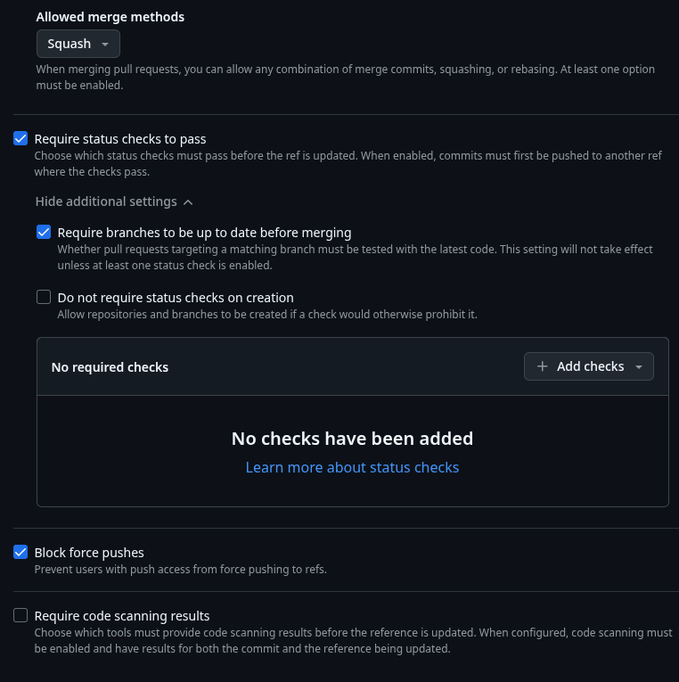

# Projekt Repository auf github einrichten

Dieser Guide geht davon aus, dass du mit dem [Leptos Template](./leptos-template.md) Guide bereits einen lokalen Projektordner aufgesetzt hast. Des Weiteren geht der Guide davon aus, dass du `github desktop` lokal installiert und mit `github` verknüpft hast. Und natürlich, dass du `git` installiert hast...

## Inhaltsverzeichnis

- [Lokales Repository mit github desktop erstellen](#lokales-repository-mit-github-desktop-erstellen)
- [Optional: Lizenz vom Projekt in github anpassen](#optional-lizenz-vom-projekt-in-github-anpassen)
- [Branch development von main erstellen](#branch-development-von-main-erstellen)
- [Branch Protection für main und development erstellen](#branch-protection-für-main-und-development-erstellen)
- [Projekt in Visual Studio Code öffnen](#projekt-in-visual-studio-code-öffnen)

## Lokales Repository mit github desktop erstellen

`github desktop` öffnen, `File -> Add local repository...` und Projektordner auswählen. Dabei musst du bereits entscheiden, ob das Projekt öffentlich oder privat sein soll. Danach in `github desktop` den initialen commit mit dem folgenden summary erstellen:

```text
chore: initial project setup
```

Wichtig ist hier das `chore:`, um `release-please` von Anfang an mit korrekten commit summaries zu bedienen. Jetzt noch in `github desktop` das Projekt nach github veröffentlichen und github im Browser öffnen.

## Optional: Lizenz vom Projekt in github anpassen

Im geöffneten `github` Projektrepo kannst du eine andere Lizenz für das Projekt wählen, in dem du die `LICENCE` Datei auswählst. Dann den entsprechenden Dialog auswählen, um die neue gewünschte Lizenz auszuwählen. Danach ist es wichtig, die geänderte Datei mit dem richtigen summary zu commiten, um `release-please` konform zu sein:

```text
doc: updated project licence
```

## Branch `development` von `main` erstellen

Erstelle in `github` den branch `development`, abgeleitet von `main`.

## Branch Protection für `main` und `development` erstellen

> 💡 **Hinweis:** Branch Protection Rules sind in `github` nur bei öffentlichen Repos wirksam.

Sowohl `main` als auch `development` sollen nur über `pull request`s bearbeitet werden. Hierfür sind die folgenden Regeln in `github` je Branch unter

`GitHub Repo > ⚙️ Settings > Branches > “Add branch ruleset”`

zu erstellen.



Im oberen Bereich Namen angeben, `Enforcement status` setzen und Branch Namen eingeben, für die das ruleset gelten soll.



Übernehme die angegeben Einstellungen.



Achte bei `Allowed merge methods`, dass nur `Squash` ausgewählt ist. Die Option `Require status checks to pass` kann erst verwendet werden, wenn durch einen commit CI Workflows ausgeführt wurden. Sobald dies erfolgt ist, empfiehlt es sich, diese hier bei `Add checks` hinzuzufügen. Diese sind aber erst nach erstmaligen Durchlauf verfügbar, so dass diese Option erst später gesetzt werden kann.

> ⚠️  **Warnung:** Vergiss nicht, diese checks nachträglich zu setzen, sobald sie einmal durchgelaufen sind.

## Projekt in Visual Studio Code öffnen

Entweder über `github desktop` oder in der Konsole im Projektordner

```bash
code .
```

ausführen. Dann über die integrierte Quellcodeverwaltung den branch `development` pullen.

---
✅ Setup ist abgeschlossen
